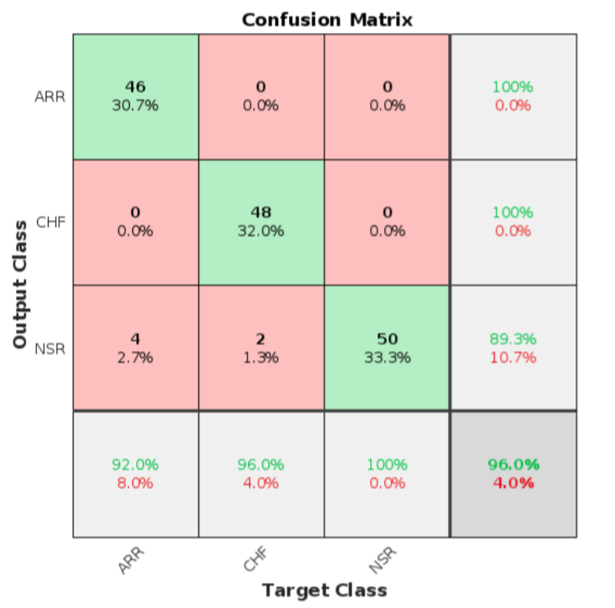
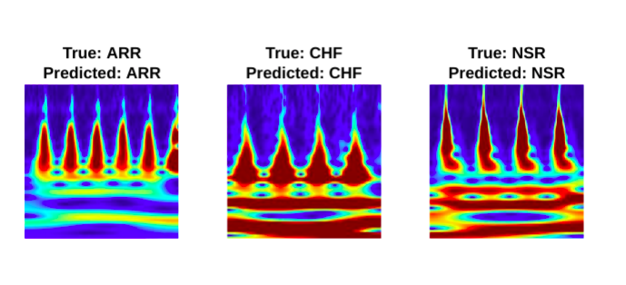
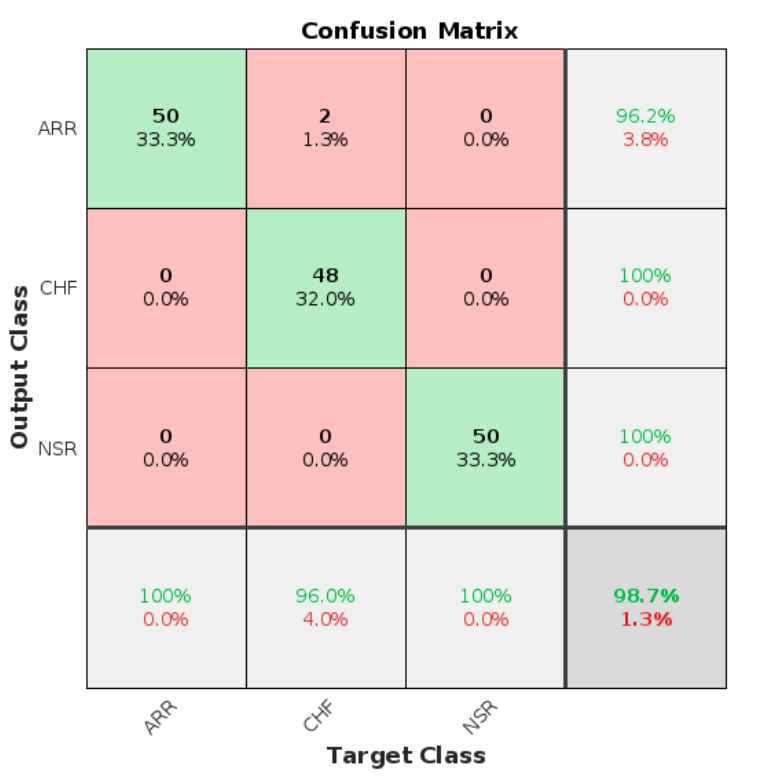
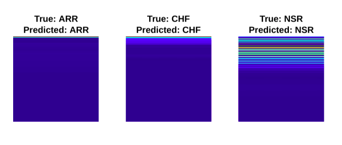

# ECG Signal Classification 

This project aims to classify human electrocardiogram (ECG) signals into three categories: persons with cardiac arrhythmia (ARR), persons with congestive heart failure (CHF), and persons with normal sinus rhythms (NSR). The classification will be performed using the Short Time Fourier Transformation (STFT) and the Continuous Wavelet Transform (CWT) along with deep convolutional neural networks (CNNs).

## Author

- [ZAID GUL](https://github.com/zaid-gul)

## Background

Electrocardiogram (ECG) signals provide important information about the electrical activity of the heart. By analyzing these signals, it is possible to detect abnormalities and classify them into different categories. 

## Getting Started

To get started with the project, follow these steps:

1. Clone the repository:

```bash
git clone https://github.com/zaid-gul/ECG_Classification.git
```

2. Open the MATLAB script **ECG_Classification_Gul.mlx** in MATLAB.
3. Run the project

## Description
The MATLAB script performs the following steps:

1. Load the ECG database from the ECGData.mat file.

2. Divide the database into three categories: ARR , CHF , and NSR .

3. Plot sample ECG signals from each category.

4. Perform Continuous Wavelet Transform (CWT) or Short Time Fourier Transformation (STFT) on the ECG signals.

5. Convert the scalograms or Spectogram into images and save them in corresponding folders for each category.

6. Divide the images into training and test sets.

7. Train the CNN (GoogleNet, SqueezeNet or AlexNet) using the training images and evaluate its performance on the test images.

8. Calculate the accuracy of the CNN and plot the confusion matrix.

9. Display sample predictions for selected images.

## Results

### Continuous Wavelet Transform (CWT)

AlexNet achieves an impressive accuracy of 96.0% in correctly classifying the test images, accurately identifying the test image with the correct label.




### Short Time Fourier Transformation (STFT)

AlexNet and SqueezeNet achieve an impressive accuracy of 98.7% in correctly classifying the test images, accurately identifying the test image with the correct label.





